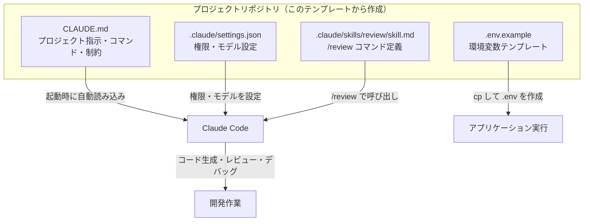

# claude-project-template

[](LICENSE)

Claude Code を使ったプロジェクト開発をすぐに始めるための GitHub テンプレートリポジトリです。
クローンした瞬間から Claude Code が正しく動作する設定ファイル一式を提供します。

---

## このテンプレートについて

### Claude Code とは

[Claude Code](https://claude.ai/code) は Anthropic が提供する AI 開発支援 CLI ツールです。
プロジェクトのソースコードや設定ファイルを読み込み、コード生成・レビュー・デバッグ・テストなどを
自然言語の指示で実行できます。

Claude Code はプロジェクトルートの `CLAUDE.md` と `.claude/` ディレクトリを自動的に読み込み、
プロジェクト固有のルール・コマンド・権限設定を把握した上で動作します。
**この設定なしに使い始めると、Claude が毎回コマンド実行の確認を求めたり、
プロジェクトの文脈を理解できず的外れな提案をすることがあります。**

### このテンプレートが提供するもの

| 課題 | このテンプレートの対処 |
| ---- | ---------------------- |
| 毎回同じ設定ファイルを手で作る手間 | すぐに使えるファイル一式を提供 |
| Claude Code の権限設定でつまずく | 安全なデフォルトを設定済み |
| CLAUDE.md に何を書けばいいかわからない | 穴埋め式の雛形を用意 |
| チームでのベースライン不足 | `settings.json` を git 管理してチーム共有 |
| 環境変数の管理方法が属人化する | `.env.example` による標準化 |

### テンプレートの構成と Claude Code の関係



---

## 含まれるファイル

```text
./
├── .claude/
│   ├── settings.json          # 権限ホワイトリスト・モデル・hooks（チーム共有）
│   └── skills/
│       └── review/
│           └── skill.md       # /review スラッシュコマンド（コードレビュー）
├── .env.example               # 環境変数のサンプル（実際の値は .env に記入）
├── .gitignore                 # Claude 固有ファイル・OS・エディタ・言語成果物を除外
├── .markdownlint.json         # Markdown linting 設定
├── CLAUDE.md                  # Claude への指示ファイル（穴埋め式）
├── LICENSE                    # Apache License 2.0
└── README.md                  # このファイル
```

### 各ファイルの役割詳細

#### `CLAUDE.md`

Claude Code が**プロジェクト起動時に必ず読み込む**指示ファイルです。
ここに書いた内容が Claude の行動ルールになります。
**200行以内**を目安に簡潔にまとめてください（長すぎるとルールが無視されます）。
詳しい書き方は[「CLAUDE.md の書き方」](#claudemd-の書き方)を参照してください。

#### `.claude/settings.json`

Claude Code の**権限設定**と**モデル設定**を記述します。
チームで共有するため git 管理します。

```json
{
  "model": "sonnet",
  "permissions": {
    "allow": ["Bash(git *)", "Bash(find . *)", "Bash(grep *)"],
    "deny":  ["Bash(rm -rf *)", "Bash(git push --force *)"]
  },
  "hooks": {}
}
```

- `permissions.allow` に追加したコマンドは確認プロンプトなしに実行されます
- `permissions.deny` に追加したコマンドは実行を完全にブロックします
- 個人的な上書き設定は `settings.local.json`（`.gitignore` 除外済み）に書きます

#### `.claude/skills/review/skill.md`

`/review` と入力すると呼び出せるカスタムスラッシュコマンドです。
コードの変更内容に対して、バグ・セキュリティ・パフォーマンス・可読性の観点でレビューを行います。
スキルは `.claude/skills/<name>/skill.md` の形式で追加するだけで自動的に `/<name>` コマンドとして使えます。
詳しい書き方は[「skill.md の書き方」](#skillmd-の書き方)を参照してください。

#### `.env.example`

チームで共有する環境変数の**サンプルファイル**です。
実際の値は `.env` に記載し、`.gitignore` で git 管理外にします。

新メンバーはこのファイルを見て必要な環境変数と取得方法を把握できます。

#### `.gitignore`

以下のカテゴリを除外設定済みです：

- Claude Code のセッション固有ファイル（`.claude/projects/`, `.claude/runs/` など）
- macOS / Linux の OS ファイル
- 主要エディタのファイル（vim, JetBrains, VSCode）
- 認証情報・秘密鍵（`.env`, `*.pem`, `*.key` など）
- Python / Node.js / Go / Rust のビルド成果物

---

## クイックスタート

### 前提条件

| ツール | バージョン | インストール |
| ------ | ---------- | ------------ |
| Node.js | v18 以上 | [nodejs.org](https://nodejs.org) |
| git | 最新版 | `brew install git` / `apt install git` |
| gh CLI | 最新版 | `brew install gh` / [GitHub CLI](https://cli.github.com) |
| Claude Code | 最新版 | `npm install -g @anthropic-ai/claude-code` |

Claude Code の初回起動時に Anthropic アカウントへのログインが必要です。

```bash
claude login
```

### テンプレートから新規プロジェクトを作成する

> [!TIP]
> GitHub の「Use this template」ボタンを使う方法と gh CLI を使う方法があります。
> どちらでも同じ結果になります。

#### gh CLI を使う場合（推奨）

```bash
gh repo create my-new-project \
  --template zabaot/claude-project-template \
  --private \
  --clone

cd my-new-project
```

#### GitHub Web UI を使う場合

1. [zabaot/claude-project-template](https://github.com/zabaot/claude-project-template) を開く
2. 右上の「Use this template」→「Create a new repository」をクリック
3. リポジトリ名・公開範囲を設定して「Create repository」
4. ローカルにクローン: `git clone git@github.com:<your-username>/my-new-project.git`

---

## セットアップ（クローン後）

### ステップ 1 — CLAUDE.md を編集する

`CLAUDE.md` を開き、`<!-- -->` のコメント部分をプロジェクトの実際の内容に書き換えます。

```bash
# エディタで開く
vim CLAUDE.md   # または code CLAUDE.md / nano CLAUDE.md
```

最低限これだけ書くと Claude の精度が大きく上がります：

```markdown
## プロジェクト概要
このプロジェクトは〇〇を実現するための API サーバーです。

## 技術スタック
Python 3.12, FastAPI, PostgreSQL 16

## コマンド
\`\`\`bash
# テスト
pytest tests/

# Lint
ruff check .
\`\`\`
```

### ステップ 2 — 環境変数を準備する

```bash
cp .env.example .env
```

`.env` を開き、必要な値を設定します。
`.env` は `.gitignore` により git 管理外です。チームメンバーには別途共有してください。

### ステップ 3 — 依存をインストールする

プロジェクトの技術スタックに合わせてコマンドを実行します。

```bash
# Python の場合
pip install -r requirements.txt

# Node.js の場合
npm install

# Go の場合
go mod download
```

### ステップ 4 — settings.json の権限を確認・調整する

`.claude/settings.json` を開き、プロジェクトで使うコマンドが `permissions.allow` に含まれているか確認します。
含まれていなければ追加してください。

```json
{
  "model": "sonnet",
  "permissions": {
    "allow": [
      "Bash(git *)",
      "Bash(find . *)",
      "Bash(grep *)",
      "Bash(ls *)",
      "Bash(cat *)",
      "Bash(echo *)",
      "Bash(pytest *)",
      "Bash(npm test)"
    ],
    "deny": [
      "Bash(rm -rf *)",
      "Bash(git push --force *)"
    ]
  }
}
```

### ステップ 5 — Claude Code を起動する

```bash
claude
```

`CLAUDE.md` の内容を Claude が読み込み、プロジェクトの文脈を理解した状態で対話が始まります。

---

## Claude Code の使い方

### インタラクティブモード（通常の開発）

```bash
claude
```

起動後、自然言語でタスクを指示します。

```text
> テストが全部通るようにバグを直して
> src/auth.py のコードをレビューして
> README.md を英語に翻訳して
```

### 非インタラクティブモード（スクリプト・CI 連携）

```bash
# 標準入力からプロンプトを渡す
claude -p "変更されたファイルの一覧を要約して"

# パイプで渡す
git diff HEAD~1 | claude -p "この差分のリスクを評価して"
```

### `/review` コマンド（同梱スキル）

```text
/review
```

直近の変更に対して以下の観点でレビューを行います：

1. **バグ・ロジックの誤り** — 実行時エラーや論理的な問題
2. **セキュリティ** — SQLインジェクション・XSS・認証漏れなど
3. **パフォーマンス** — N+1 クエリ・不要なループなど
4. **可読性** — 命名の問題・複雑すぎる処理など

出力形式: 問題がある場合は `ファイル名:行番号 — 問題の説明`、問題がない場合は「問題なし」

---

## CLAUDE.md の書き方

### 基本原則

- **200行以内**を目安に短くまとめる。長すぎると Claude がルールを無視するようになる
- 各行に「これを削除したら Claude は誤判断するか？」と問い、NO なら削除する
- ビルド・テストコマンドなど Claude が実際に実行する情報を優先する

### 読み込み優先順位

複数の CLAUDE.md が存在する場合、後者が前者を上書きします。

```text
~/.claude/CLAUDE.md        ← 全セッション共通（個人設定）
        ↓ 上書き
./CLAUDE.md                ← プロジェクト共通（チーム共有・git 管理）
        ↓ 上書き
./CLAUDE.local.md          ← 個人用（.gitignore 除外・チーム共有しない）
```

### 推奨セクション構成

```markdown
# CLAUDE.md

## プロジェクト概要
（1〜3行。Claude がコードの意図を理解するための最低限の背景）

## 技術スタック
（言語・フレームワーク・主要ライブラリとバージョン）

## コマンド
（ビルド・テスト・Lint を具体的に。Claude が実際に実行する）

## ディレクトリ構成
（重要な 3〜5 ディレクトリのみ。自明なものは省く）

## 重要な制約・注意事項
（やってはいけない操作・隠れた前提条件）

## 外部サービス・認証情報
（利用サービス一覧と .env の変数名。値は書かない）
```

### @import で外部ファイルを読み込む

CLAUDE.md が長くなりすぎる場合、内容をファイルに分割して読み込めます。

```markdown
# CLAUDE.md

@docs/architecture.md
@docs/api-conventions.md
@~/.claude/personal-preferences.md
```

パスはリポジトリルートからの相対パスまたは絶対パスが使えます。

### 書くべき内容・避けるべき内容

| 書くべき内容 | 避けるべき内容 |
| ------------ | -------------- |
| ビルド・テスト・Lint コマンド | API ドキュメント（リンクを貼るだけでよい） |
| コードスタイル・命名規則 | コード例（ファイルへの参照でよい） |
| やってはいけない操作と理由 | 頻繁に変わる情報 |
| アーキテクチャ上の決定とその背景 | 自明な慣習（「変数名は意味のある名前に」など） |
| 環境変数の一覧と取得方法 | 長い説明文・手順書（skill.md に移す） |

### CLAUDE.local.md（個人用メモ）

チームの `CLAUDE.md` に書きたくない個人設定（好みのエイリアス・作業手順・実験的な設定）は
`CLAUDE.local.md` に書いて `.gitignore` に追加します。

```markdown
# CLAUDE.local.md
（.gitignore 除外済み・自分だけが読む）

## 個人メモ
- レビュー時は必ず日本語でコメントすること
- テストは pytest -x で止める（全件走らせない）
```

---

## skill.md の書き方

スキルは CLAUDE.md に書くには長すぎる**繰り返しの手順**や**チェックリスト**を
切り出すのに適しています。呼び出したときだけ読み込まれるためコンテキストの節約にもなります。

### 基本構造

```markdown
---
description: このスキルの用途説明（Claude が自動選択する際に参照される）
---

# スキル名

ここに Claude への指示を自然言語で記述します。
```

### フロントマターの設定項目

| キー | 説明 | 例 |
| ---- | ---- | -- |
| `description` | スキルの用途。Claude が関連タスク時に自動選択する判断基準になる | `"PR の変更内容をレビューする"` |
| `disable-model-invocation: true` | 手動呼び出し専用にする（Claude が自動選択しなくなる） | `true` |
| `tools` | このスキル内で使えるツールを制限する | `["Bash", "Read"]` |
| `context: fork` | サブエージェントとして隔離実行する | `fork` |

### $ARGUMENTS — 引数を受け取る

`/skill-name 引数` の形で渡した文字列を `$ARGUMENTS` で参照できます。

```markdown
---
description: 指定したファイルをレビューする
---

# /file-review

$ARGUMENTS のコードを以下の観点でレビューしてください。

1. バグ・ロジックの誤り
2. セキュリティ上の問題
3. パフォーマンス上の問題
```

呼び出し例:

```text
/file-review src/auth.py
```

`$ARGUMENTS` が `src/auth.py` に展開されて実行されます。

### !`cmd` — コマンド出力をスキルに埋め込む

バッククォートで囲んだシェルコマンドの実行結果をスキルの本文に展開できます。

```markdown
---
description: 現在の変更状況を確認してレビューする
---

# /check

以下の情報をもとに変更内容を評価してください。

## 現在の差分
!`git diff HEAD`

## 最近のコミット
!`git log --oneline -10`
```

### context: fork — サブエージェントとして隔離実行する

`context: fork` を指定するとスキルがサブエージェントとして起動し、
メインの会話コンテキストを汚さずに重いタスクを実行できます。

```markdown
---
description: テストを隔離実行して結果を報告する
context: fork
---

# /test-isolated

以下のコマンドでテストを実行し、失敗した項目のみを一覧で報告してください。

\`\`\`bash
pytest tests/ -v --tb=short
\`\`\`
```

### CLAUDE.md と skill.md の使い分け

| 内容 | 置き場所 |
| ---- | -------- |
| 常に参照が必要なルール・コマンド | `CLAUDE.md` |
| 繰り返す長い手順（デプロイ・レビューなど） | `skill.md` |
| 特定のファイルや状況にのみ適用するルール | `skill.md`（description で判断） |
| 自分だけが使う個人メモ・手順 | `CLAUDE.local.md` |

> [!TIP]
> CLAUDE.md が 100 行を超えてきたら、長い手順を skill.md に切り出すサインです。
> skill.md はオンデマンド読み込みなので、どれだけ増やしてもコンテキストを消費しません。

---

## カスタマイズガイド

### スキルを追加する

`/deploy` コマンドを追加する例：

```bash
mkdir -p .claude/skills/deploy
```

`.claude/skills/deploy/skill.md` を作成：

```markdown
# /deploy

本番環境へのデプロイ前チェックリストを実行してください。

## チェック項目

1. テストがすべて通ること: `pytest tests/`
2. Lint エラーがないこと: `ruff check .`
3. マイグレーションが適用済みであること
4. 環境変数が本番用に設定されていること
```

`claude` を起動後に `/deploy` で呼び出せます。

### Hooks を設定する

`settings.json` の `hooks` にイベント駆動のコマンドを設定できます。

```json
{
  "hooks": {
    "sessionStart": [
      {
        "type": "command",
        "command": "echo 'Claude Code セッション開始'"
      }
    ]
  }
}
```

利用可能なイベント: `sessionStart`, `beforePermissionPrompt` など

### settings.local.json で個人設定を上書きする

チーム共有の `settings.json` を変えずに個人設定を追加したい場合は
`.claude/settings.local.json` を作成します（`.gitignore` 除外済み）。

```json
{
  "model": "opus",
  "theme": "dark"
}
```

---

## 注意事項

> [!WARNING]
> **CLAUDE.md に機密情報を書かない**
>
> `CLAUDE.md` は git 管理されます。API キー・パスワード・接続文字列などは
> `.env`（git 除外済み）に記載してください。
> CLAUDE.md には「.env の `DATABASE_URL` を参照」のように書くだけで十分です。

> [!CAUTION]
> **`settings.json` の過剰な allow は危険**
>
> `"Bash(*)"` のようにワイルドカードで全コマンドを許可すると、
> Claude が意図しないシステム破壊的なコマンドを実行する可能性があります。
> 使用するコマンドを具体的に列挙してください。

> [!NOTE]
> **このREADMEはプロジェクト作成後に書き換えてください**
>
> テンプレートから作成した新規プロジェクトでは、
> この README をプロジェクト固有の内容に完全に書き換えてください。
> このファイルはあくまでテンプレートリポジトリの説明です。

> [!NOTE]
> **settings.json が Claude Code によって自動更新されることがある**
>
> セッション中に Claude Code がパーミッション設定を `settings.json` に追記する場合があります。
> コミット前に `git diff .claude/settings.json` で意図しない変更がないか確認してください。

---

## ライセンス

このテンプレートは [Apache License 2.0](LICENSE) のもとで公開されています。
テンプレートから作成したプロジェクトには本ライセンスは適用されません。
プロジェクトごとに適切なライセンスを選択してください。
