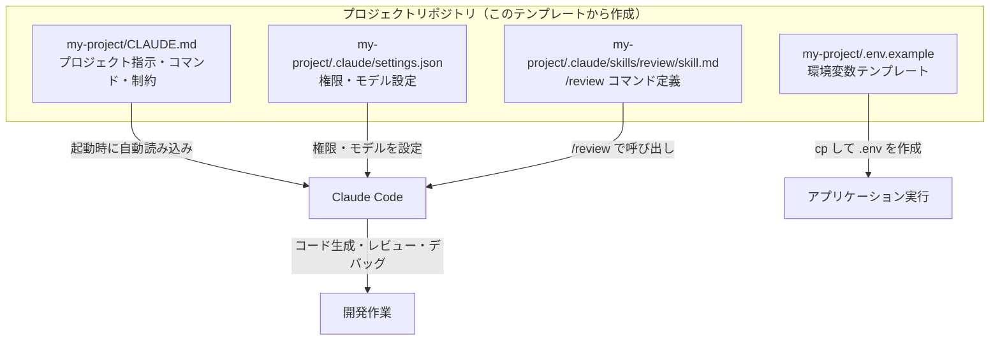
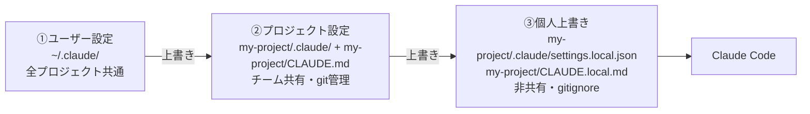
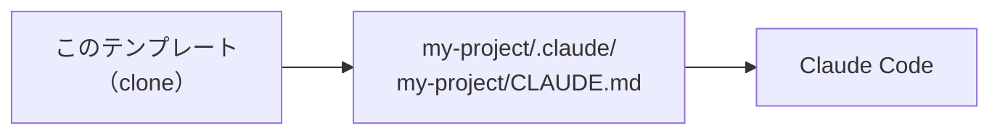
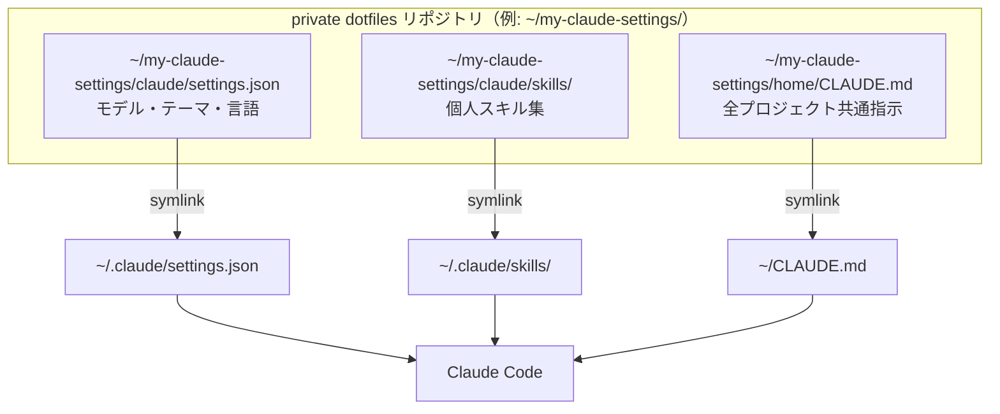
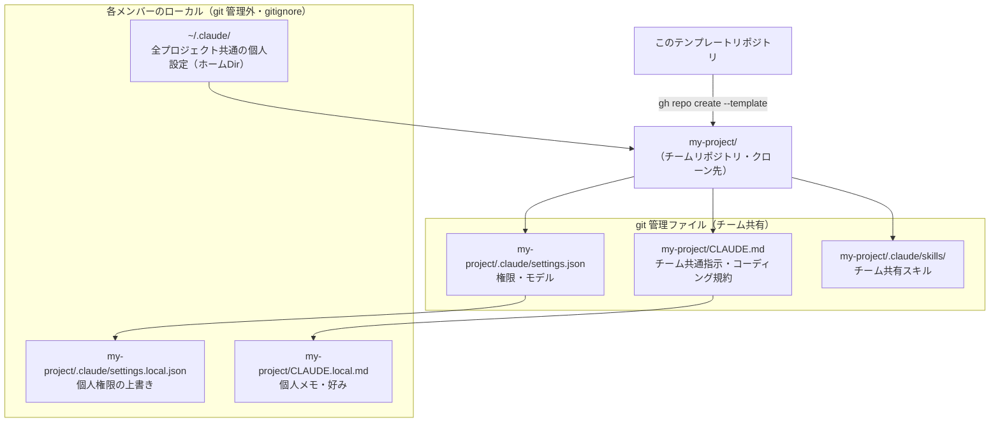
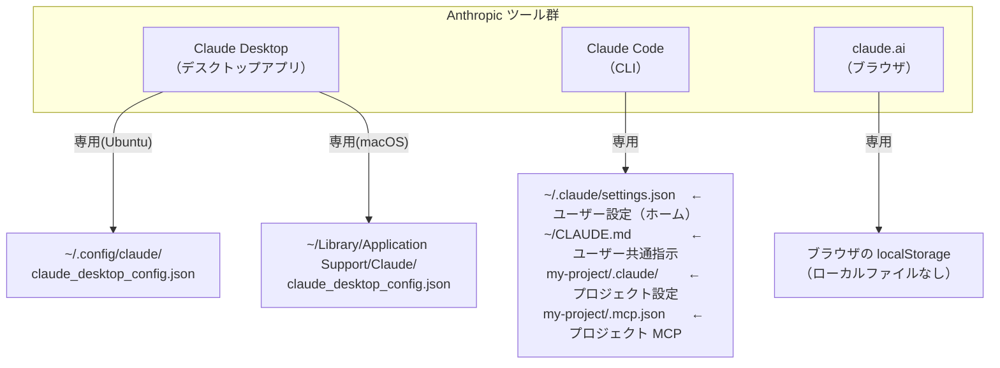
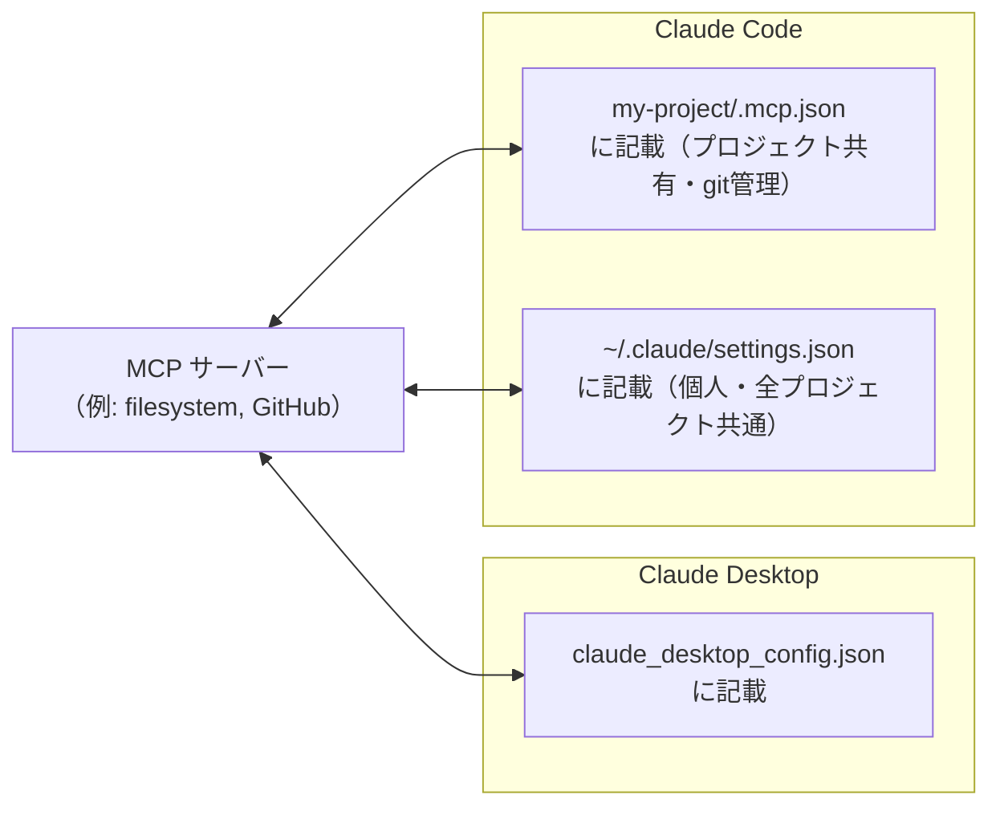

# claude-project-template

[](LICENSE)

Claude Code を使ったプロジェクト開発をすぐに始めるための GitHub テンプレートリポジトリです。
クローンした瞬間から Claude Code が正しく動作する設定ファイル一式を提供します。

---

## このテンプレートについて

### Claude Code とは

[Claude Code](https://claude.ai/code) は Anthropic が提供する AI 開発支援 CLI ツールです。
プロジェクトのソースコードや設定ファイルを読み込み、コード生成・レビュー・デバッグ・テストなどを
自然言語の指示で実行できます。

Claude Code はプロジェクトルートの `CLAUDE.md` と `.claude/` ディレクトリを自動的に読み込み、
プロジェクト固有のルール・コマンド・権限設定を把握した上で動作します。
**この設定なしに使い始めると、Claude が毎回コマンド実行の確認を求めたり、
プロジェクトの文脈を理解できず的外れな提案をすることがあります。**

### このテンプレートが提供するもの

| 課題 | このテンプレートの対処 |
| ---- | ---------------------- |
| 毎回同じ設定ファイルを手で作る手間 | すぐに使えるファイル一式を提供 |
| Claude Code の権限設定でつまずく | 安全なデフォルトを設定済み |
| CLAUDE.md に何を書けばいいかわからない | 穴埋め式の雛形を用意 |
| チームでのベースライン不足 | `settings.json` を git 管理してチーム共有 |
| 環境変数の管理方法が属人化する | `.env.example` による標準化 |

### テンプレートの構成と Claude Code の関係



---

## 推奨運用パターン

Claude Code の設定はユーザーレベル・プロジェクトレベル・個人上書きの 3 層構造になっています。
このテンプレートはプロジェクトレベルを担います。
用途に合わせて以下のパターンを選んでください。

### 設定の優先順位（全体像）

後の層が前の層を上書きします。すべての層は同時に読み込まれ、競合箇所のみ上書きされます。

> [!NOTE]
> **このREADMEのパス表記**
> `my-project/` はプロジェクトルートの例です。実際のプロジェクト名（例: `todo-app/`）に読み替えてください。
> `~/` はホームディレクトリです（Ubuntu: `/home/yourname/`、macOS: `/Users/yourname/`）。



| 層 | 場所 | git 管理 | 誰が使うか |
| -- | ---- | -------- | ---------- |
| ① ユーザー設定 | `~/.claude/` | しない | 自分の全プロジェクトに適用したい設定 |
| ② プロジェクト設定 | `my-project/.claude/` + `my-project/CLAUDE.md` | する | チームで統一したい設定・指示 |
| ③ 個人上書き | `my-project/.claude/settings.local.json` + `my-project/CLAUDE.local.md` | しない | チーム設定を個人用に調整するメモ |

---

### パターン 1 — 個人開発・単一マシン（最小構成）

このテンプレートをクローンするだけで始められます。



**手順:**

```bash
# 1. テンプレートから新規リポジトリを作成
#    my-project → 任意のプロジェクト名に変更
#    zabaot/claude-project-template → このテンプレートリポジトリ（変更不要）
gh repo create my-project \
  --template zabaot/claude-project-template \
  --private --clone

cd my-project

# 2. CLAUDE.md をプロジェクトに合わせて編集
vim CLAUDE.md

# 3. 起動
claude
```

このパターンで十分なケース:

- 個人プロジェクト・検証・学習用途
- 単一マシンで完結する開発

---

### パターン 2 — 個人開発・複数マシン（設定を同期したい）

`~/.claude/` の個人設定をプライベートリポジトリで管理し、symlink で接続します。
新しいマシンでもクローン一発で同じ環境が再現できます。



**セットアップ手順（初回）:**

```bash
# 1. 個人設定用のプライベートリポジトリを作成
mkdir ~/my-claude-settings
cd ~/my-claude-settings
git init && git branch -M main

# 2. ユーザーレベルの設定ファイルを作成
mkdir -p claude/skills

cat > claude/settings.json << 'EOF'
{
  "model": "sonnet",
  "theme": "dark",
  "language": "ja"
}
EOF

# 3. 全プロジェクト共通の指示ファイルを作成
mkdir home
cat > home/CLAUDE.md << 'EOF'
# CLAUDE.md

## 環境
- Ubuntu / macOS
- Shell: zsh

## 個人ルール
- コメントは日本語で書く
- テストは必ず書く
EOF

# 4. symlink で ~/.claude/ に接続
mkdir -p ~/.claude
ln -sf ~/my-claude-settings/claude/settings.json ~/.claude/settings.json
ln -sf ~/my-claude-settings/home/CLAUDE.md ~/CLAUDE.md

# 5. GitHub にプッシュ
gh repo create my-claude-settings --private --source . --push
```

**別マシンでの再現:**

```bash
git clone git@github.com:<your-username>/my-claude-settings.git ~/my-claude-settings
ln -sf ~/my-claude-settings/claude/settings.json ~/.claude/settings.json
ln -sf ~/my-claude-settings/home/CLAUDE.md ~/CLAUDE.md
```

このパターンで十分なケース:

- 複数のマシンで同じ Claude Code 環境を使いたい
- 個人スキル（`/review` など）を全プロジェクトで共有したい
- `~/CLAUDE.md` に共通ルール（言語・スタイル）を一度だけ書きたい

---

### パターン 3 — チーム開発

このテンプレートをベースにプロジェクトを作成し、
チームメンバーそれぞれが個人設定をパターン 2 で管理します。



**チームでの役割分担:**

| 誰が | 何を | ファイルパス | git 管理 |
| ---- | ---- | ------------ | -------- |
| チーム全員で合意 | コーディング規約・禁止操作 | `my-project/CLAUDE.md` | する |
| チームリーダー | 権限ホワイトリスト・モデル | `my-project/.claude/settings.json` | する |
| チーム全員 | 共有するスラッシュコマンド | `my-project/.claude/skills/` | する |
| 各メンバー | 個人的な権限追加・上書き | `my-project/.claude/settings.local.json` | しない |
| 各メンバー | 個人メモ・作業手順 | `my-project/CLAUDE.local.md` | しない |

**新メンバーの参加手順:**

```bash
# 1. リポジトリをクローン
git clone git@github.com:<org>/my-project.git
cd my-project

# 2. 必要なら個人設定を上書き（任意）
cat > .claude/settings.local.json << 'EOF'
{
  "model": "opus"
}
EOF

# 3. 個人メモを追加（任意）
cat > CLAUDE.local.md << 'EOF'
## 個人メモ
- 自分の担当は認証モジュール（src/auth/）
EOF

# 4. 起動
claude
```

> [!NOTE]
> `my-project/.claude/settings.local.json` と `my-project/CLAUDE.local.md` は
> 自動的に `.gitignore` 対象です。誤ってコミットする心配はありません。

このパターンが必要なケース:

- 複数人でリポジトリを共有する
- チームで Claude Code の使い方を統一したい
- 新メンバーがすぐに同じ環境で開発を始められるようにしたい

---

## Claude Desktop・claude.ai との共存

### ツールごとのファイル管理は完全に独立

Claude には複数の入口がありますが、**設定ファイルはツールごとに独立**しています。
互いに干渉することはありません。



### ファイルの棲み分け一覧

| ファイルパス | 作成するツール | 役割 |
| ------------ | -------------- | ---- |
| `~/.config/claude/claude_desktop_config.json` | Claude Desktop（Ubuntu） | Desktop 専用の MCP サーバー設定 |
| `~/Library/Application Support/Claude/claude_desktop_config.json` | Claude Desktop（macOS） | 同上（macOS パス） |
| `~/.claude/settings.json` | Claude Code（初回起動時） | **ユーザーレベル**設定。全プロジェクト共通のモデル・テーマ・言語 |
| `~/CLAUDE.md` | ユーザーが作成 | **ユーザーレベル**指示。全プロジェクト共通のルール |
| `my-project/.claude/settings.json` | ユーザーが作成 | **プロジェクトレベル**設定。チーム共有・git 管理（このテンプレートに含む） |
| `my-project/.mcp.json` | ユーザーが作成 | **プロジェクトレベル** MCP 設定。チーム共有・git 管理 |

> [!NOTE]
> `~/.claude/` ディレクトリは **Claude Code の初回起動時に自動作成**されます。
> Claude Desktop が作るのではありません。Desktop が使うのは Ubuntu では `~/.config/claude/`、macOS では `~/Library/Application Support/Claude/` のみです。

### MCP の設定は別々に行う

MCP（Model Context Protocol）サーバーを使う場合、
Claude Desktop と Claude Code それぞれに個別に設定が必要です。



**Claude Desktop への MCP 追加（Ubuntu）:**

```bash
# 設定ファイルを作成・編集
mkdir -p ~/.config/claude
nano ~/.config/claude/claude_desktop_config.json
# または: xdg-open ~/.config/claude/claude_desktop_config.json
```

**Claude Desktop への MCP 追加（macOS）:**

```bash
# 設定ファイルを開く
open ~/Library/Application\ Support/Claude/claude_desktop_config.json
```

```json
{
  "mcpServers": {
    "filesystem": {
      "command": "npx",
      "args": ["-y", "@modelcontextprotocol/server-filesystem", "/path/to/dir"]
    }
  }
}
```

**Claude Code へのプロジェクト MCP 追加（プロジェクトルート直下の `.mcp.json`）:**

```json
{
  "mcpServers": {
    "github": {
      "command": "npx",
      "args": ["-y", "@modelcontextprotocol/server-github"],
      "env": { "GITHUB_TOKEN": "${GITHUB_TOKEN}" }
    }
  }
}
```

プロジェクトルート直下に `.mcp.json` を置くと git 管理してチームで共有できます。機密情報は環境変数経由で渡してください。

### 整理のポイント

| 状況 | 対処 |
| ---- | ---- |
| Desktop を入れたら `~/.claude/` ができていた | Claude Code の初回起動で作成されたもの。Desktop は関与しない |
| Desktop の MCP が Code で使えない | Code 側の `my-project/.mcp.json`（チーム共有）または `~/.claude/settings.json`（個人）に別途追加する |
| claude.ai の会話設定をローカルに持ちたい | claude.ai はファイルを使わない。`CLAUDE.md` に指示を書く |
| 設定を変えたのに反映されない | `permissions` / `hooks` / `env` はホットリロード対応。`model` などは再起動が必要 |

---

## 含まれるファイル

```text
./
├── .claude/
│   ├── settings.json          # 権限ホワイトリスト・モデル・hooks（チーム共有）
│   └── skills/
│       └── review/
│           └── skill.md       # /review スラッシュコマンド（コードレビュー）
├── .env.example               # 環境変数のサンプル（実際の値は .env に記入）
├── .gitignore                 # Claude 固有ファイル・OS・エディタ・言語成果物を除外
├── .markdownlint.json         # Markdown linting 設定
├── CLAUDE.md                  # Claude への指示ファイル（穴埋め式）
├── LICENSE                    # Apache License 2.0
└── README.md                  # このファイル
```

### 各ファイルの役割詳細

#### `CLAUDE.md`

Claude Code が**プロジェクト起動時に必ず読み込む**指示ファイルです。
ここに書いた内容が Claude の行動ルールになります。
**200行以内**を目安に簡潔にまとめてください（長すぎるとルールが無視されます）。
詳しい書き方は[「CLAUDE.md の書き方」](#claudemd-の書き方)を参照してください。

#### `.claude/settings.json`

Claude Code の**権限設定**と**モデル設定**を記述します。
チームで共有するため git 管理します。

```json
{
  "model": "sonnet",
  "permissions": {
    "allow": ["Bash(git *)", "Bash(find . *)", "Bash(grep *)"],
    "deny":  ["Bash(rm -rf *)", "Bash(git push --force *)"]
  },
  "hooks": {}
}
```

- `permissions.allow` に追加したコマンドは確認プロンプトなしに実行されます
- `permissions.deny` に追加したコマンドは実行を完全にブロックします
- 個人的な上書き設定は `settings.local.json`（`.gitignore` 除外済み）に書きます

#### `.claude/skills/review/skill.md`

`/review` と入力すると呼び出せるカスタムスラッシュコマンドです。
コードの変更内容に対して、バグ・セキュリティ・パフォーマンス・可読性の観点でレビューを行います。
スキルは `.claude/skills/<name>/skill.md` の形式で追加するだけで自動的に `/<name>` コマンドとして使えます。
詳しい書き方は[「skill.md の書き方」](#skillmd-の書き方)を参照してください。

#### `.env.example`

チームで共有する環境変数の**サンプルファイル**です。
実際の値は `.env` に記載し、`.gitignore` で git 管理外にします。

新メンバーはこのファイルを見て必要な環境変数と取得方法を把握できます。

#### `.gitignore`

以下のカテゴリを除外設定済みです：

- Claude Code のセッション固有ファイル（`.claude/projects/`, `.claude/runs/` など）
- Linux / macOS の OS ファイル
- 主要エディタのファイル（vim, JetBrains, VSCode）
- 認証情報・秘密鍵（`.env`, `*.pem`, `*.key` など）
- Python / Node.js / Go / Rust のビルド成果物

---

## クイックスタート

### 前提条件

| ツール | バージョン | インストール |
| ------ | ---------- | ------------ |
| Node.js | v18 以上 | [nodejs.org](https://nodejs.org) |
| git | 最新版 | `apt install git` / `brew install git` |
| gh CLI | 最新版 | [GitHub CLI](https://cli.github.com) / `brew install gh` |
| Claude Code | 最新版 | `npm install -g @anthropic-ai/claude-code` |

Claude Code の初回起動時に Anthropic アカウントへのログインが必要です。

```bash
claude login
```

### テンプレートから新規プロジェクトを作成する

> [!TIP]
> GitHub の「Use this template」ボタンを使う方法と gh CLI を使う方法があります。
> どちらでも同じ結果になります。

#### gh CLI を使う場合（推奨）

```bash
# my-new-project → 任意のプロジェクト名に変更
# zabaot/claude-project-template → このテンプレートリポジトリ（変更不要）
gh repo create my-new-project \
  --template zabaot/claude-project-template \
  --private \
  --clone

cd my-new-project
```

#### GitHub Web UI を使う場合

1. [zabaot/claude-project-template](https://github.com/zabaot/claude-project-template) を開く
2. 右上の「Use this template」→「Create a new repository」をクリック
3. リポジトリ名・公開範囲を設定して「Create repository」
4. ローカルにクローン: `git clone git@github.com:<your-username>/my-new-project.git`

---

## セットアップ（クローン後）

### ステップ 1 — CLAUDE.md を編集する

`CLAUDE.md` を開き、`<!-- -->` のコメント部分をプロジェクトの実際の内容に書き換えます。

```bash
# エディタで開く
vim CLAUDE.md   # または code CLAUDE.md / nano CLAUDE.md
```

最低限これだけ書くと Claude の精度が大きく上がります：

```markdown
## プロジェクト概要
このプロジェクトは〇〇を実現するための API サーバーです。

## 技術スタック
Python 3.12, FastAPI, PostgreSQL 16

## コマンド
\`\`\`bash
# テスト
pytest tests/

# Lint
ruff check .
\`\`\`
```

### ステップ 2 — 環境変数を準備する

```bash
cp .env.example .env
```

`.env` を開き、必要な値を設定します。
`.env` は `.gitignore` により git 管理外です。チームメンバーには別途共有してください。

### ステップ 3 — 依存をインストールする

プロジェクトの技術スタックに合わせてコマンドを実行します。

```bash
# Python の場合
pip install -r requirements.txt

# Node.js の場合
npm install

# Go の場合
go mod download
```

### ステップ 4 — settings.json の権限を確認・調整する

`.claude/settings.json` を開き、プロジェクトで使うコマンドが `permissions.allow` に含まれているか確認します。
含まれていなければ追加してください。

```json
{
  "model": "sonnet",
  "permissions": {
    "allow": [
      "Bash(git *)",
      "Bash(find . *)",
      "Bash(grep *)",
      "Bash(ls *)",
      "Bash(cat *)",
      "Bash(echo *)",
      "Bash(pytest *)",
      "Bash(npm test)"
    ],
    "deny": [
      "Bash(rm -rf *)",
      "Bash(git push --force *)"
    ]
  }
}
```

### ステップ 5 — Claude Code を起動する

```bash
claude
```

`CLAUDE.md` の内容を Claude が読み込み、プロジェクトの文脈を理解した状態で対話が始まります。

---

## Claude Code の使い方

### インタラクティブモード（通常の開発）

```bash
claude
```

起動後、自然言語でタスクを指示します。

```text
> テストが全部通るようにバグを直して
> src/auth.py のコードをレビューして
> README.md を英語に翻訳して
```

### 非インタラクティブモード（スクリプト・CI 連携）

```bash
# 標準入力からプロンプトを渡す
claude -p "変更されたファイルの一覧を要約して"

# パイプで渡す
git diff HEAD~1 | claude -p "この差分のリスクを評価して"
```

### `/review` コマンド（同梱スキル）

```text
/review
```

直近の変更に対して以下の観点でレビューを行います：

1. **バグ・ロジックの誤り** — 実行時エラーや論理的な問題
2. **セキュリティ** — SQLインジェクション・XSS・認証漏れなど
3. **パフォーマンス** — N+1 クエリ・不要なループなど
4. **可読性** — 命名の問題・複雑すぎる処理など

出力形式: 問題がある場合は `ファイル名:行番号 — 問題の説明`、問題がない場合は「問題なし」

---

## CLAUDE.md の書き方

詳細ガイド → **[docs/writing-claude-md.md](docs/writing-claude-md.md)**

### 要点

- **200行以内**を目安に短くまとめる。長すぎると Claude がルールを無視する
- `@import` で外部ファイルを分割して読み込める
- `my-project/CLAUDE.local.md` は個人メモ用（`.gitignore` 除外済み）

### 読み込み優先順位（後ろが上書き）

```text
~/CLAUDE.md                ← 全セッション共通（個人設定・ホームDir）
        ↓
my-project/CLAUDE.md        ← プロジェクト共通（チーム共有・git 管理）
        ↓
my-project/CLAUDE.local.md  ← 個人用（.gitignore 除外・チーム共有しない）
```

### 書くべき内容・避けるべき内容

| 書くべき内容 | 避けるべき内容 |
| ------------ | -------------- |
| ビルド・テスト・Lint コマンド | API ドキュメント（リンクを貼るだけでよい） |
| やってはいけない操作と理由 | コード例（ファイルへの参照でよい） |
| 環境変数の一覧と取得方法 | 長い説明文・手順書（skill.md に移す） |

---

## skill.md の書き方

詳細ガイド → **[docs/writing-skill-md.md](docs/writing-skill-md.md)**

### skill.md の要点

- `.claude/skills/<name>/skill.md` を作成するだけで `/<name>` コマンドになる
- `$ARGUMENTS` で引数を受け取り、`` !`cmd` `` でコマンド出力を展開できる
- `context: fork` でサブエージェントとして隔離実行できる

### CLAUDE.md と skill.md の使い分け

| 内容 | 置き場所 |
| ---- | -------- |
| 常に参照が必要なルール・コマンド | `my-project/CLAUDE.md` |
| 繰り返す長い手順（デプロイ・レビューなど） | `my-project/.claude/skills/<name>/skill.md` |
| 自分だけが使う個人メモ・手順 | `my-project/CLAUDE.local.md` |

> [!TIP]
> CLAUDE.md が 100 行を超えてきたら、長い手順を skill.md に切り出すサインです。
> skill.md はオンデマンド読み込みなので、どれだけ増やしてもコンテキストを消費しません。

---

## カスタマイズガイド

### スキルを追加する

`/deploy` コマンドを追加する例：

```bash
mkdir -p .claude/skills/deploy
```

`.claude/skills/deploy/skill.md` を作成：

```markdown
# /deploy

本番環境へのデプロイ前チェックリストを実行してください。

## チェック項目

1. テストがすべて通ること: `pytest tests/`
2. Lint エラーがないこと: `ruff check .`
3. マイグレーションが適用済みであること
4. 環境変数が本番用に設定されていること
```

`claude` を起動後に `/deploy` で呼び出せます。

### Hooks を設定する

`settings.json` の `hooks` にイベント駆動のコマンドを設定できます。

```json
{
  "hooks": {
    "sessionStart": [
      {
        "type": "command",
        "command": "echo 'Claude Code セッション開始'"
      }
    ]
  }
}
```

利用可能なイベント: `sessionStart`, `beforePermissionPrompt` など

### settings.local.json で個人設定を上書きする

チーム共有の `settings.json` を変えずに個人設定を追加したい場合は
`.claude/settings.local.json` を作成します（`.gitignore` 除外済み）。

```json
{
  "model": "opus",
  "theme": "dark"
}
```

---

## 注意事項

> [!WARNING]
> **CLAUDE.md に機密情報を書かない**
>
> `CLAUDE.md` は git 管理されます。API キー・パスワード・接続文字列などは
> `.env`（git 除外済み）に記載してください。
> CLAUDE.md には「.env の `DATABASE_URL` を参照」のように書くだけで十分です。

> [!CAUTION]
> **`settings.json` の過剰な allow は危険**
>
> `"Bash(*)"` のようにワイルドカードで全コマンドを許可すると、
> Claude が意図しないシステム破壊的なコマンドを実行する可能性があります。
> 使用するコマンドを具体的に列挙してください。

> [!NOTE]
> **クローン後に対応が必要なファイル**
>
> このテンプレートには、テンプレート自体の説明ファイルが含まれています。
> プロジェクト作成後に以下の対応をしてください。
>
> | ファイル | 対応 |
> | -------- | ---- |
> | `README.md`（このファイル） | プロジェクト固有の内容に**書き換え**てください |
> | `docs/writing-claude-md.md` | CLAUDE.md 書き方ガイドです。参照後は**削除**してください |
> | `docs/writing-skill-md.md` | skill.md 書き方ガイドです。参照後は**削除**してください |
> | `LICENSE` | Apache 2.0 です。プロジェクトに合わせて**変更**してください |
>
> ```bash
> # docs/ を削除する場合
> git rm -r docs/
> git commit -m "Remove template docs"
> ```

> [!NOTE]
> **settings.json が Claude Code によって自動更新されることがある**
>
> セッション中に Claude Code がパーミッション設定を `settings.json` に追記する場合があります。
> コミット前に `git diff .claude/settings.json` で意図しない変更がないか確認してください。

---

## ライセンス

このテンプレートは [Apache License 2.0](LICENSE) のもとで公開されています。
テンプレートから作成したプロジェクトには本ライセンスは適用されません。
プロジェクトごとに適切なライセンスを選択してください。
